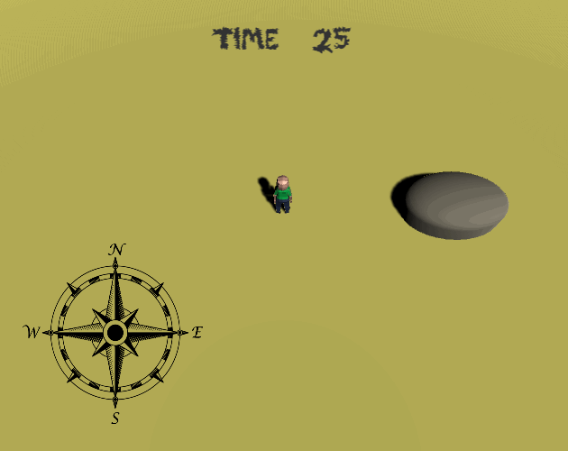

  

## Play

Game page on itch.io: https://guibdbello.itch.io/treasure-chasers

  

### How to Play

#### As the Adventurer

- `WASD`: Move.
- Look at the level and tell the Professor the objects that you can see.

#### As the Professor

- Open the Treasure Chasing 101 document (download the PDF/PNG or read online, links below).
- Receive the Adventurer information.
- Inform the right direction for the Adventurer to find the Treasure. If you inform the wrong direction, the player will get lost and it's game over.

##### Treasure Chasing 101

- [Treasure Chasing 101 (PDF)](./media/Treasure%20Chasing%20101.pdf)
- [Google Drive (Read-only)](https://docs.google.com/document/d/1-wOkZvF8J9bFWrYoKvRWGKW32fUwVw-QmfFqJDV0d3c/edit?usp=sharing)
- 

## About

Treasure hunting multiplayer communication game where one player plays as the Adventurer and the other plays as the Professor.

### Game Jam

This game was made for the game jam [**Multiplayer Jam**](https://itch.io/jam/multiplayer-jam) which took place between July 31st and August 13th of 2020.

Theme: **Desert**.

## Setup

### Installation

1. Clone repository: `git clone https://github.com/GuiBDBello/TreasureChasers.git`.
2. Add the project to Unity Hub: `ADD > Select the folder you just cloned`.
3. Select the project to open.

### Development

1. Use Unity interface to change the levels.
2. Use your favorite IDE/Text Editor to code (I recommend Visual Studio or Visual Studio Code).

**Obs.:** Some links that may be helpful:

- https://learn.unity.com
- https://www.youtube.com/channel/UCYbK_tjZ2OrIZFBvU6CCMiA

### Build

1. In Unity, with the project open, go to `File > Build Settings...` then select `Build`.

## Credits

### Template

- <a href='https://www.template.net/editable/5224/used-car-bill-of-sale'>Created by Template.net</a>
