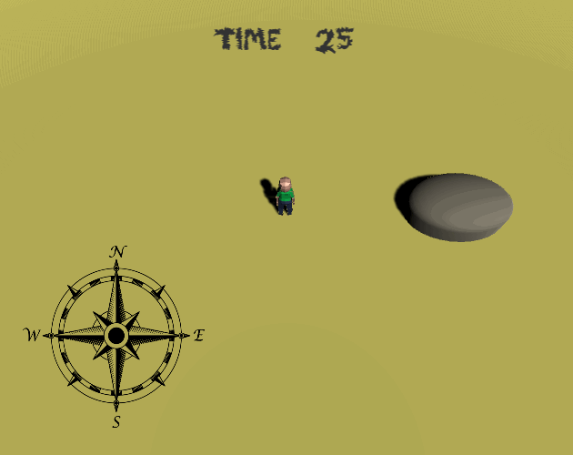
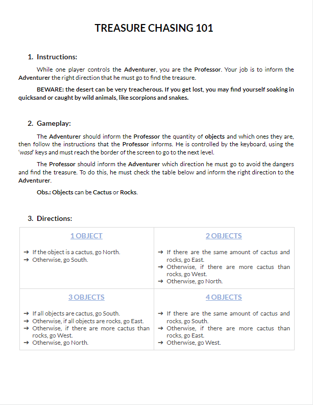

  

  Treasure hunting multiplayer communication game.
   
   
  <a href="https://guibdbello.itch.io/treasure-chasers">Play Game</a>
  ·
  <a href="https://github.com/GuiBDBello/TreasureChasers/issues/new?labels=bug&template=bug-report---.md">Report Bug</a>
  ·
  <a href="https://github.com/GuiBDBello/TreasureChasers/issues/new?labels=enhancement&template=feature-request---.md">Request Feature</a>

## Table of Contents

<ol>
  <li><a href="#introduction">Introduction</a></li>
  <li><a href="#getting-started">Getting Started</a></li>
  <li><a href="#build-process">Build Process</a></li>
  <li><a href="#acknowledgments">Acknowledgments</a></li>
  <li><a href="#license">License</a></li>
</ol>

## Introduction

Treasure hunting multiplayer communication game where one player plays as the Adventurer and the other plays as the Professor.

  

### How to Play

#### As the Adventurer

- **WASD**: Move.
- Look at the level and tell the Professor the objects that you can see.

#### As the Professor

- Open the Treasure Chasing 101 document (download the PDF/PNG or read online, links below).
- Receive the Adventurer information.
- Inform the right direction for the Adventurer to find the Treasure. If you inform the wrong direction, the player will get lost and it's game over.

##### Treasure Chasing 101

- [Treasure Chasing 101 (PDF)](./media/Treasure%20Chasing%20101.pdf)
- [Google Drive (Read-only)](https://docs.google.com/document/d/1-wOkZvF8J9bFWrYoKvRWGKW32fUwVw-QmfFqJDV0d3c/edit?usp=sharing)
- 

### Game Jam

This game was made for the game jam [Multiplayer Jam](https://itch.io/jam/multiplayer-jam), which took place between July 31st and August 13th of 2020.

Theme: **Desert**.

(<a href="#readme-top">back to top</a>)

## Getting Started

To get a local copy up and running follow the steps below.

### Prerequisites

1. [Unity](https://unity.com/download)

### Configuration

1. Clone repository: `git clone https://github.com/GuiBDBello/TreasureChasers.git`.
1. Add the project to Unity or Unity Hub: `ADD > Select the folder you just cloned`.
1. Open project.

(<a href="#readme-top">back to top</a>)

## Build Process

1. With your project opened in Unity, select `File > Build Settings...`.
1. Select the `Platform` that you wish to build for (you may have to install a build module if you don't have it already installed).
1. Select `Build` or `Build And Run`.

(<a href="#readme-top">back to top</a>)

## Acknowledgments

List of references that were useful in the making of this project:

* [Unity Learn](https://learn.unity.com/)
* [Brackeys](https://www.youtube.com/channel/UCYbK_tjZ2OrIZFBvU6CCMiA)

### Assets

| Name | Type | Creator | Source |
| --- | --- | --- | --- |
| Document Template | Document | [Template.net](https://www.template.net/) | [Template](https://www.template.net/editable/5224/used-car-bill-of-sale) |

(<a href="#readme-top">back to top</a>)

## License

Distributed under the MIT License. See [LICENSE](./LICENSE) for more information.

(<a href="#readme-top">back to top</a>)

